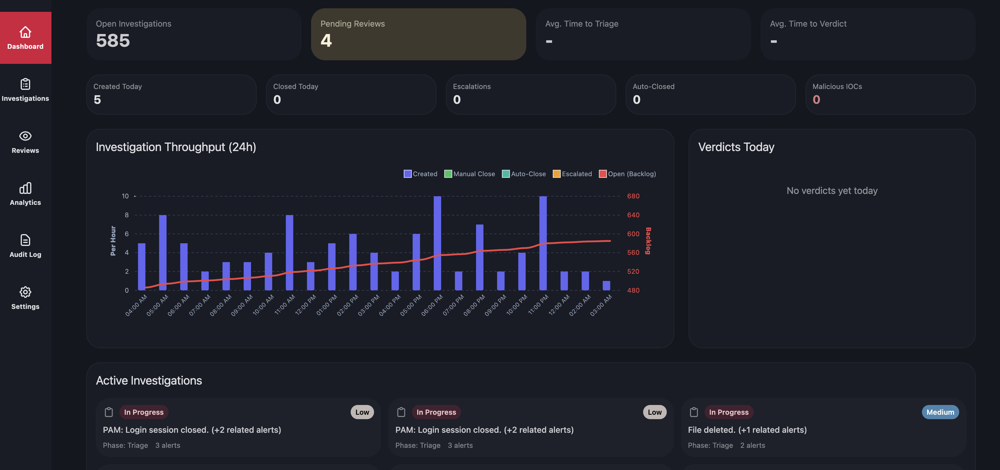
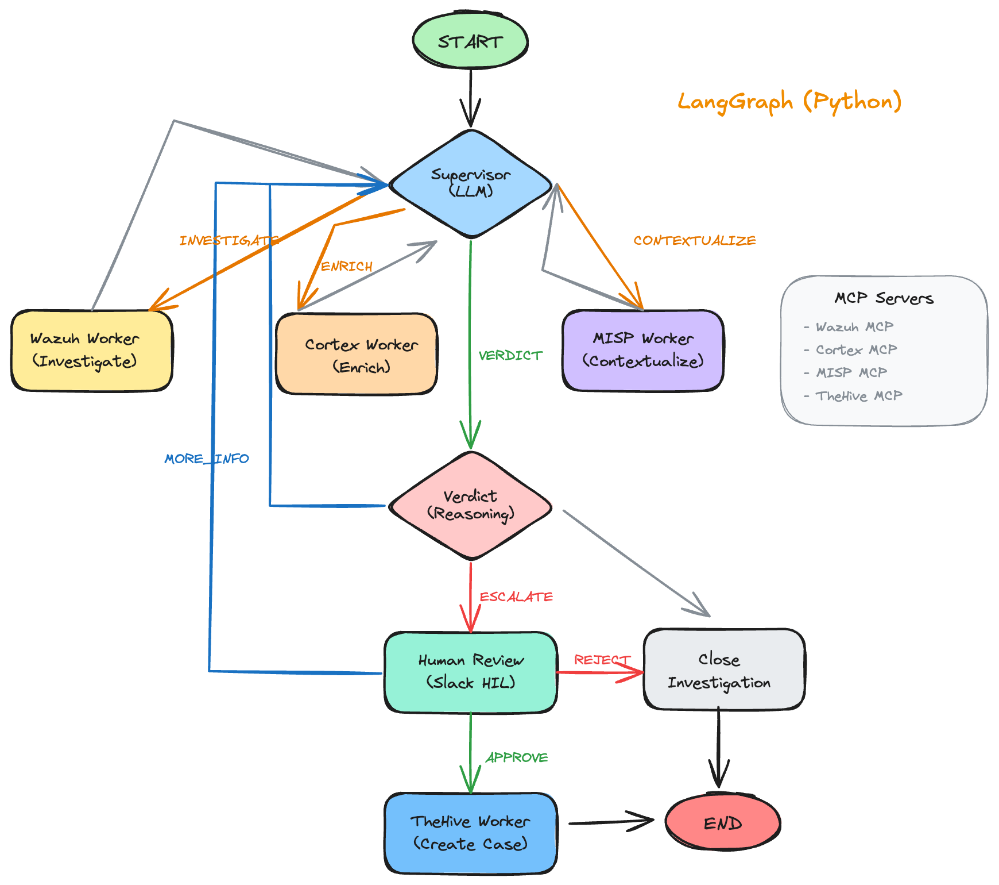

# SocTalk

LLM-powered SOC agent that autonomously triages, investigates, and escalates security alerts.



Integrates with Wazuh SIEM, Cortex, TheHive, and MISP via MCP servers, plus a real-time dashboard.

## Quick Start

### Docker Compose (recommended)

```bash
cp .env.example .env
docker compose up -d --build postgres api frontend
```

Open:
- Dashboard: http://localhost:5173
- API (OpenAPI): http://localhost:8000/docs
- Health: http://localhost:8000/health

Start the orchestrator (for end-to-end flow):

```bash
docker compose up -d --build orchestrator
docker compose logs -f orchestrator
```

The orchestrator image bundles MCP server binaries at `/opt/mcp-servers/*`.

### Local development

Backend:

```bash
python -m venv .venv
source .venv/bin/activate
pip install -e ".[dev]"

cp .env.example .env
docker compose up -d postgres
alembic upgrade head

uvicorn soctalk.api.app:app --host 0.0.0.0 --port 8000 --env-file .env --reload
```

Frontend:

```bash
cd frontend
pnpm install
pnpm dev
```

Dev helper to run everything locally:

```bash
./scripts/run-dev.sh start
```

## Features

- **Supervisor + specialized workers** for routing/enrichment across Wazuh, Cortex, MISP, TheHive
- **Two-tier LLM** (fast router + reasoning verdict) with Anthropic or OpenAI-compatible providers
- **Continuous Wazuh polling** with correlation and prioritization
- **Human-in-the-loop** approvals (dashboard/Slack/CLI)
- **Event sourcing + CQRS** for auditability and replay
- **Real-time dashboard** (SvelteKit + SSE)
- **Configurable integrations** via Settings UI (secrets remain env-only)

## How It Works

SocTalk is split into three pieces: an **orchestrator** (LangGraph workflow), an **API** that streams events and exposes REST, and a **dashboard** for investigations and human review.

**High-level flow**
1. **Ingest:** Poll Wazuh alerts and correlate into an investigation.
2. **Investigate:** Supervisor routes work to MCP-backed workers (Wazuh/Cortex/MISP/TheHive).
3. **Decide:** Reasoning LLM produces a verdict; thresholds pick auto-close vs escalate.
4. **Approve:** Human review via dashboard interrupt/resume, Slack HIL, or CLI fallback.
5. **Act:** Create cases/incidents in TheHive and notify via Slack webhook.
6. **Persist + stream:** Events go to Postgres (when enabled); API streams updates to the UI over SSE.

**Building blocks**
- **LangGraph workflow:** encodes triage → enrichment → verdict → human review → response.
- **MCP servers (integrations):** `mcp-server-wazuh`, `mcp-server-cortex`, `mcp-server-misp`, `mcp-server-thehive`.
- **Integrated solutions:** Wazuh (SIEM), Cortex (analysis), MISP (threat intel), TheHive (case/IR).
- **Mock agents:** containerized Wazuh agents that execute MITRE ATT&CK-style techniques to generate realistic alerts.
- **Orchestrator (`soctalk` CLI):** runs polling/correlation and the LangGraph.
- **Persistence (Postgres):** event store + projections for timelines, metrics, and dashboards.
- **API (FastAPI) + Dashboard (SvelteKit):** REST, SSE event stream, metrics, review queue, settings.
- **Settings + secrets:** non-secret prefs editable in UI and stored in DB; secrets stay in env.

**Workflow diagram**




## Configuration

Copy `.env.example` to `.env` and set what you need.

**LLM provider (mutually exclusive)**
- `SOCTALK_LLM_PROVIDER=anthropic` + `ANTHROPIC_API_KEY`
- `SOCTALK_LLM_PROVIDER=openai` + `OPENAI_API_KEY` (OpenAI-compatible)
- Optional: `ANTHROPIC_BASE_URL`, `OPENAI_BASE_URL`/`OPENAI_API_BASE`, `OPENAI_ORGANIZATION`
- Models/params: `SOCTALK_FAST_MODEL`, `SOCTALK_REASONING_MODEL`, `SOCTALK_LLM_TEMPERATURE`, `SOCTALK_LLM_MAX_TOKENS`

**Integrations (MCP)**
- Toggles: `WAZUH_ENABLED`, `CORTEX_ENABLED`, `THEHIVE_ENABLED`, `MISP_ENABLED`
- URLs/non-secrets (UI-editable): `WAZUH_URL`, `CORTEX_URL`/`CORTEX_ENDPOINT`, `THEHIVE_URL`, `THEHIVE_ORGANISATION`, `MISP_URL`, `*_VERIFY_SSL`
- Secrets (env-only): `WAZUH_API_USER`/`WAZUH_API_PASSWORD`, `CORTEX_API_KEY`, `THEHIVE_API_KEY`/`THEHIVE_API_TOKEN`, `MISP_API_KEY`

**Notifications**
- `SLACK_ENABLED`, `SLACK_CHANNEL`, `SLACK_NOTIFY_ON_ESCALATION`, `SLACK_NOTIFY_ON_VERDICT`
- Secret (env-only): `SLACK_WEBHOOK_URL`

**MCP server binaries**

The orchestrator requires MCP server binaries to communicate with external tools.

**Docker (automatic)**

The orchestrator image downloads pre-built binaries from GitHub releases at build time and installs them to `/opt/mcp-servers/*`.

**Local development**

Build from source or download binaries manually, then set paths in `.env`.

*Build from source (requires Rust):*
```bash
git clone https://github.com/gbrigandi/mcp-server-wazuh && cd mcp-server-wazuh && cargo build --release
```

*Set paths to your builds:*
```bash
WAZUH_MCP_SERVER_PATH=../mcp-server-wazuh/target/release/mcp-server-wazuh
CORTEX_MCP_SERVER_PATH=../mcp-server-cortex/target/release/mcp-server-cortex
THEHIVE_MCP_SERVER_PATH=../mcp-server-thehive/target/release/mcp-server-thehive
MISP_MCP_SERVER_PATH=../mcp-server-misp/target/release/mcp-server-misp
```

Alternatively, set `MCP_SERVERS_BASE_PATH` to a directory containing all four binaries.

**Polling + thresholds**
- `SOCTALK_POLLING_INTERVAL`, `SOCTALK_MAX_ALERTS_PER_POLL`, `SOCTALK_BATCH_SIZE`, `SOCTALK_CORRELATION_WINDOW`
- `SOCTALK_AUTO_CLOSE_THRESHOLD`, `SOCTALK_ESCALATION_THRESHOLD`, `SOCTALK_CRITICAL_SEVERITY`

**Database / persistence**
- Enable: `SOCTALK_DB_ENABLED=true`
- URL: `SOCTALK_DATABASE_URL`
- Run migrations: `alembic upgrade head`

**Settings UI**
- Non-secret prefs stored in DB and override env defaults (see Preferences below).
- `SETTINGS_READONLY=true` disables edits/resets (recommended for production).

**Auth (optional)**
- `AUTH_MODE=none|static|proxy`
- Static users: `AUTH_USERS` (pbkdf2_sha256 recommended)
- Session: `AUTH_SESSION_SECRET`, `AUTH_SESSION_TTL_SECONDS`, `AUTH_COOKIE_SECURE`

**Logging**
- `SOCTALK_LOG_LEVEL`, `SOCTALK_LOG_FORMAT`, `RUST_LOG` (for MCP servers)

## Preferences (Settings UI)

The dashboard Settings page shows where a value comes from (Env vs Override) and lets you edit non-secret preferences. Secrets stay in the environment. Changes apply when the orchestrator restarts and reloads settings.

**LLM**
- `llm_provider`: `anthropic` or `openai` (requires matching env API key; keys are mutually exclusive).
- `llm_fast_model`, `llm_reasoning_model`, `llm_temperature` (0–2), `llm_max_tokens`.
- `llm_anthropic_base_url` (optional), `llm_openai_base_url` (optional), `llm_openai_organization` (optional).

**Wazuh**
- `wazuh_enabled`, `wazuh_url`, `wazuh_verify_ssl` (env-only secrets for credentials).

**Cortex**
- `cortex_enabled`, `cortex_url`, `cortex_verify_ssl` (env-only `CORTEX_API_KEY`).

**TheHive**
- `thehive_enabled`, `thehive_url`, `thehive_organisation`, `thehive_verify_ssl` (env-only API key/token).

**MISP**
- `misp_enabled`, `misp_url`, `misp_verify_ssl` (env-only API key).

**Slack**
- `slack_enabled`, `slack_channel`, `slack_notify_on_escalation`, `slack_notify_on_verdict` (env-only webhook URL).

## Mock Agents (attack simulator)

The `mock-endpoint` service runs a real Wazuh agent that executes MITRE ATT&CK-style techniques to produce high-signal alerts for testing.

Prerequisites:
- Reachable Wazuh manager (agent registration + TCP) on ports `1515` and `1514`.
- SocTalk configured to poll the Wazuh API (`WAZUH_ENABLED=true` and credentials in env).

Deploy and generate alerts:
```bash
# start mock agent (testing profile)
docker compose --profile testing up -d --build mock-endpoint
docker compose logs -f mock-endpoint

# list available techniques
docker compose exec mock-endpoint /opt/scripts/run-attack.sh list
# run specific techniques (examples)
docker compose exec mock-endpoint /opt/scripts/run-attack.sh T1110.001    # brute-force auth log spam
docker compose exec mock-endpoint /opt/scripts/run-attack.sh T1059.SHELL # reverse-shell command traces
docker compose exec mock-endpoint /opt/scripts/run-attack.sh MALWARE     # ransomware-like artifacts
```

How it triggers suspicious actions:
- Writes attack traces to syslog/auth logs (e.g., failed SSH logins, reverse-shell commands).
- Creates or modifies temporary artifacts under `/tmp/attack-artifacts` to trip FIM rules.
- Periodic/random technique execution keeps alert volume flowing (configurable via env/cron in the container).

Use only in a lab: the container runs privileged and intentionally generates noisy behavior.

## Usage Examples

```bash
# Print the LangGraph (mermaid)
soctalk --graph

# Run with a specific env file
soctalk --config .env
```

API quick checks:

```bash
curl http://localhost:8000/health
curl -N http://localhost:8000/api/events/stream
```

## Testing

Backend:
```bash
pytest -m "not integration"
```

Integration (Postgres):
```bash
docker compose -f docker-compose.test.yml up -d
pytest -m integration
```

Frontend:
```bash
cd frontend
pnpm check
pnpm test   # Playwright
```

## License

MIT
