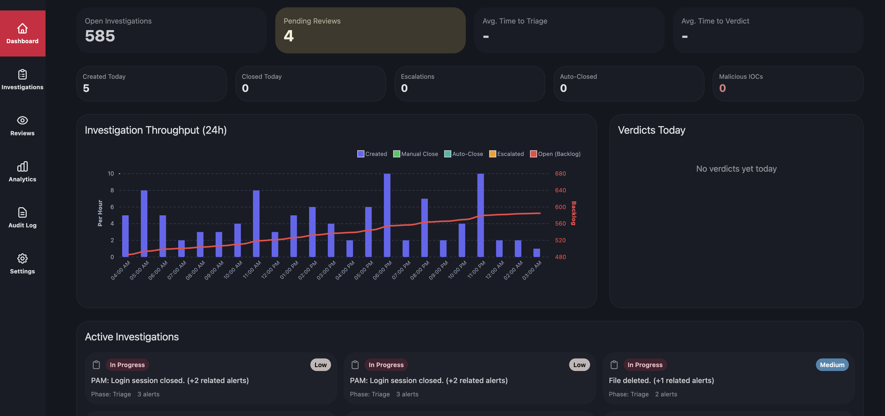
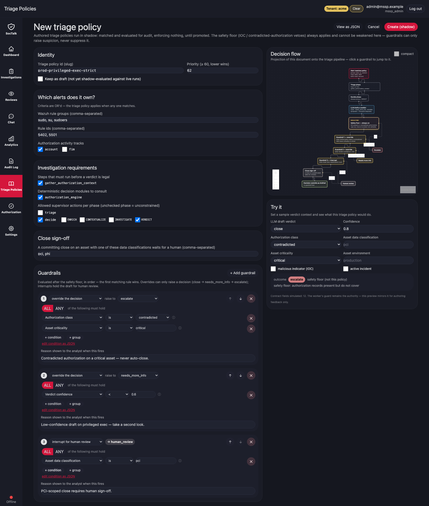

# SocTalk

> Open-source, LLM-driven SOC automation. Continuously triages, investigates,
> and escalates Wazuh alerts: for one team on a single host, or for MSPs and
> MSSPs across tenants.

**[soctalk.ai](https://soctalk.ai)** ·
**[Docs](https://soctalk.github.io/soctalk-docs/)** ·
**[How it compares](https://soctalk.ai/compare/)** ·
**[Talk with the maintainer](https://calendly.com/gianluca_brigandi/soctalk-adopter-intro)**



SocTalk turns raw Wazuh alerts into investigated, prioritized, and (when policy
allows) auto-closed cases. A two-tier LLM pipeline routes and reasons over each
alert, human review keeps an analyst in control of escalations and gated
actions, and a built-in incident-response workflow records the decision trail
for audit. You can also just ask: a scope-aware chat answers questions about
your SOC in plain English, across the whole MSSP fleet or scoped to a single
tenant. Apache-2.0, Wazuh-powered, bring your own LLM (Anthropic, any
OpenAI-compatible provider, or local models), self-host anywhere.

## Try it in 5 minutes

The demo VM is **batteries-included**: Ubuntu, K3s, the SocTalk charts, and a
first-boot setup wizard baked into one image. Download it, boot it, click through
the wizard.

Prefer installing onto a Linux host you already run instead of booting an
appliance? The RPM and DEB packages give you the same stack in one command:
**[Install from an OS package](https://soctalk.github.io/soctalk-docs/os-packages)**.

**GUI (VirtualBox):** the easiest cross-platform desktop path (Windows, Linux,
Intel Mac): create a VM from the image and boot. Full walkthrough with
screenshots: **[Run on VirtualBox](https://soctalk.github.io/soctalk-docs/virtualbox)**.

**CLI (KVM / QEMU):**

```bash
# grab the latest demo image (qcow2 shown; other formats on the Downloads page)
url=$(curl -fsSL https://api.github.com/repos/soctalk/soctalk/releases/latest \
  | grep -o 'https://[^"]*qcow2\.xz' | head -1)
curl -L -O "$url"; img=$(basename "$url"); xz -d "$img"; img=${img%.xz}

# boot with KVM and forward the setup wizard to localhost:8443
qemu-system-x86_64 -m 8G -smp 4 -enable-kvm \
  -drive file="$img",if=virtio \
  -netdev user,id=n,hostfwd=tcp::8443-:8443 -device virtio-net,netdev=n -nographic
```

Then open `https://localhost:8443` and finish in the wizard. Other platforms
(VMware, Hyper-V, Proxmox, AWS, Azure) and the full walkthrough:
**[Quickstart](https://soctalk.github.io/soctalk-docs/quickstart-vm)** ·
**[Downloads](https://soctalk.github.io/soctalk-docs/downloads)**.

## Run an MSSP pilot

When the single-box demo has shown you the loop,
**[Launchpad](https://soctalk.github.io/soctalk-docs/launchpad)** takes you to
a real multi-VM pilot: an MSSP control plane plus one or more customer
tenants on your own infrastructure, joined over your Tailscale tailnet and
installed from public sources. Driving it from the web console is about five
minutes of form filling and 15 to 25 minutes of wall clock, most of it spent
on downloads. The end state is a fleet-scoped AI analyst answering
questions across your pilot tenants. Prefer to understand every step before
a tool runs it for you? The
[do-it-yourself pilot](https://soctalk.github.io/soctalk-docs/mssp-pilot)
walks the same install by hand.


## Features

- **Two-tier LLM triage**: fast router plus reasoning verdict, with Anthropic, any OpenAI-compatible provider, or local Ollama models ([LLM providers](https://soctalk.github.io/soctalk-docs/integrate/llm-providers), [Ollama](https://soctalk.github.io/soctalk-docs/integrate/ollama))
- **Conversational chat**: ask the SocTalk agent in plain language, scope-aware across every tenant (MSSP-wide) or bound to one customer (tenant scope)
- **Flexible Wazuh**: provision a dedicated Wazuh SIEM per tenant, or connect SocTalk to a customer's existing Wazuh ([provision a tenant Wazuh](https://soctalk.github.io/soctalk-docs/guides/wazuh-tenant-onboarding), [connect an existing Wazuh](https://soctalk.github.io/soctalk-docs/guides/existing-wazuh))
- **Continuous Wazuh polling** with correlation and prioritization into investigations
- **Human review**: every AI escalation and gated response action waits for an analyst decision in the dashboard review queue, recorded in an append-only audit log ([docs](https://soctalk.github.io/soctalk-docs/human-review))
- **Triage policies**: no-code guardrails run by a deterministic interpreter; authored policies can only make triage stricter, never suppress a detection ([docs](https://soctalk.github.io/soctalk-docs/triage-policies))
- **Response playbooks**: final dispositions can dispatch signed disposition envelopes to your SOAR webhook; containment actions are always analyst-approved proposals ([docs](https://soctalk.github.io/soctalk-docs/response-playbooks))
- **Built-in incident response** and case workflow; TheHive ([docs](https://soctalk.github.io/soctalk-docs/integrate/thehive)), Cortex ([docs](https://soctalk.github.io/soctalk-docs/integrate/cortex)), and MISP are optional integrations
- **Service KPIs**: alert volume, time-to-verdict, time-to-review, and escalation rate, at both the MSSP (cross-tenant) and per-tenant level
- **Event-sourced**: investigations keep an append-only event history for audit, surfaced in the dashboard
- **Multi-tenant**: isolated per-customer SOC stacks on k3s/k8s, Postgres row-level security, per-tenant LLM credentials and branding

## No-code editors for triage and response

Both governance surfaces ship with visual editors. Policies and playbooks are
data run by deterministic interpreters, so what you author is exactly what
executes, and both start in shadow mode so you can watch them against live
traffic before anything changes behavior.

### Triage policy editor

Build guardrails from typed conditions, watch the document project onto the
triage pipeline as a live decision flow, and test a sample verdict in the
built-in simulator before you ship. Authored policies can only make triage
stricter: overrides raise decisions, interrupts hold them for human review,
and suppression is not expressible.
**[Triage policies docs](https://soctalk.github.io/soctalk-docs/triage-policies)**



### Response playbook editor

Bind final dispositions to vetted capabilities: annotate the investigation,
deliver a signed disposition envelope to your SOAR webhook, or propose an
external action such as isolating an endpoint. Playbooks match on Wazuh rule
groups and ATT&CK techniques or tactics, the flow view shows what fires on
close and on escalate, and gated actions always wait for an analyst before
they execute.
**[Response playbooks docs](https://soctalk.github.io/soctalk-docs/response-playbooks)**


## Multi-tenant (MSP / MSSP)


Run SocTalk as an MSSP control plane that provisions and operates a dedicated
SOC stack per customer. Each tenant runs in its own Kubernetes namespace with
isolated credentials, branding, and tenant-scoped state under Postgres RLS. For
each tenant, deploy a dedicated Wazuh SIEM or connect to one the customer
already runs; service KPIs roll up across the whole fleet and drill down per
tenant. Two Helm charts ship: `soctalk-system` (control plane) and
`soctalk-tenant` (the per-customer stack the controller renders and applies).
See the **[MSSP UI tour](https://soctalk.github.io/soctalk-docs/mssp-ui)** and
**[Tenant lifecycle](https://soctalk.github.io/soctalk-docs/tenant-lifecycle)**.
For how this model relates to MDR services, wholesale SOC desks, and building
your own Wazuh stack, see **[soctalk.ai/compare](https://soctalk.ai/compare/)**.

## Documentation

Full docs live at **[soctalk.github.io/soctalk-docs](https://soctalk.github.io/soctalk-docs/)**.
This README links the highest-intent entry points; platform walkthroughs,
operational runbooks, and the deep reference pages live on the docs site.

- **Get started**: [Quickstart](https://soctalk.github.io/soctalk-docs/quickstart-vm) · [Downloads](https://soctalk.github.io/soctalk-docs/downloads) · [OS packages](https://soctalk.github.io/soctalk-docs/os-packages) · [Production install](https://soctalk.github.io/soctalk-docs/install)
- **Concepts**: [AI pipeline](https://soctalk.github.io/soctalk-docs/ai-pipeline) · [Triage policies](https://soctalk.github.io/soctalk-docs/triage-policies) · [Response playbooks](https://soctalk.github.io/soctalk-docs/response-playbooks) · [Human review](https://soctalk.github.io/soctalk-docs/human-review)
- **Operate**: [Launchpad](https://soctalk.github.io/soctalk-docs/launchpad) · [MSSP pilot](https://soctalk.github.io/soctalk-docs/mssp-pilot) · [Tenant lifecycle](https://soctalk.github.io/soctalk-docs/tenant-lifecycle) · [Authorization](https://soctalk.github.io/soctalk-docs/authorization)
- **Integrate**: [LLM providers](https://soctalk.github.io/soctalk-docs/integrate/llm-providers) · [Ollama](https://soctalk.github.io/soctalk-docs/integrate/ollama) · [Slack](https://soctalk.github.io/soctalk-docs/integrate/slack)
- **Guides**: [Connecting an existing Wazuh](https://soctalk.github.io/soctalk-docs/guides/existing-wazuh) · [Onboarding a customer tenant](https://soctalk.github.io/soctalk-docs/guides/wazuh-tenant-onboarding) · [Keeping the AI triage bill low](https://soctalk.github.io/soctalk-docs/guides/inference-cost-optimization) · [Multi-tenant Wazuh for MSSPs](https://soctalk.github.io/soctalk-docs/guides/multi-tenant-wazuh-mssp)
- **Reference**: [Architecture](https://soctalk.github.io/soctalk-docs/reference/architecture) · [Security model](https://soctalk.github.io/soctalk-docs/reference/security-model) · [Sizing](https://soctalk.github.io/soctalk-docs/reference/sizing) · [REST API](https://soctalk.github.io/soctalk-docs/reference/api)

Docs and the product site are available in seven languages: English,
Português, Español, 简体中文, Français, Deutsch, Italiano.

## Talk with the maintainer

I'm Gianluca, and I build SocTalk. If you're evaluating it for your own team
or for your customers, hit a wall in the setup wizard, want a second opinion
on an architecture, or are thinking about contributing, book 30 minutes with
me:

**[calendly.com/gianluca_brigandi/soctalk-adopter-intro](https://calendly.com/gianluca_brigandi/soctalk-adopter-intro)**

There is no sales script and nothing to sign up for. Bring a technical
question, a use case, or plain curiosity. Single-team deployments are as
welcome as MSSP fleets. If a call is not your thing,
[open an issue](https://github.com/soctalk/soctalk/issues) or message me on
Telegram: [@gbrigandi](https://t.me/gbrigandi).

## Contributing

Issues and pull requests are welcome. See [CONTRIBUTING.md](CONTRIBUTING.md)
and the [contributor guide](https://soctalk.github.io/soctalk-docs/contribute).

## License

Apache 2.0. See [`LICENSE`](LICENSE) and [`NOTICE`](NOTICE).
